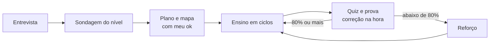

# Tutor Adaptativo

Meu sistema pessoal de estudo para o Claude: **ao vivo** e **adaptativo**, para **qualquer matéria** — programação, idiomas, matemática, ciências, música, concursos, um curso inteiro ou uma dúvida solta.

Em vez de entregar material pronto, o Claude **ensina comigo em conversa**: descobre onde meu conhecimento termina, propõe um plano que eu aprovo, ensina uma ideia por vez e confere na hora se ela pegou.



## O que tem aqui

```
.claude-plugin/marketplace.json          ← catálogo: permite instalar direto do GitHub
plugins/tutor-adaptativo/
├── .claude-plugin/plugin.json           ← manifesto do plugin
├── hooks/hooks.json                     ← abertura da sessão e diário (veja "Hooks")
├── output-styles/tutor.md               ← estilo de resposta opcional: voz de professor (veja "Dicas")
├── evals/                               ← 9 testes automáticos (veja "Testes automáticos")
├── skills/tutor-adaptativo/             ← a skill
│   ├── SKILL.md                         ← perfil, regras e comandos
│   ├── CHANGELOG.md
│   ├── references/                      ← o passo a passo de cada etapa (10 arquivos)
│   └── scripts/                         ← quiz.py, fila.py, cofre.py, render.py, selftest.py
├── agents/
│   ├── tutor-pesquisador.md             ← subagente: verifica fatos e acha fontes
│   └── tutor-diagramador.md             ← subagente: cria diagramas e os verifica
LICENSE                                  ← MIT
```

## Instalar

### A) Plugin no Claude Code (skill + subagentes) — recomendado

No Claude Code:

```text
/plugin marketplace add IvoL1/tutor-adaptativo
/plugin install tutor-adaptativo@tutor-adaptativo
```

### B) Só a skill, sem plugin

Copie a pasta `plugins/tutor-adaptativo/skills/tutor-adaptativo` para `~/.claude/skills/`. Para ter também os subagentes, copie `plugins/tutor-adaptativo/agents/*.md` para `~/.claude/agents/`.

### C) App do Claude (skill avulsa)

Gere um ZIP **da pasta da skill** (`tutor-adaptativo`, com `SKILL.md` e `references/`) — a pasta da skill precisa ficar na raiz do ZIP — e suba em **Customize → Skills → + → Create skill → Upload a skill**. É preciso ter *Code execution and file creation* ligado (Settings → Capabilities). Skills enviadas ao app valem só para a sua conta e **não** sincronizam com o Claude Code: cada lugar recebe a sua cópia.

Dica: anexe esse ZIP numa *Release* do GitHub, porque o ZIP automático do GitHub embrulha tudo numa pasta `nome-do-repositório-tag`, e o nome da pasta deixa de ser o da skill.

> Sem subagentes e sem acesso a arquivos (caso do chat do claude.ai), a skill continua funcionando: ela mesma pesquisa e desenha, e no lugar dos registros em disco entrega um **Cartão de retomada** no fim de cada sessão, que você cola na próxima. Ver `references/ferramentas.md` e `references/sessao.md`.

## Como usar

1. **Matéria nova:** diga "quero estudar X". Ela faz a entrevista, a sondagem e o plano.
2. **Dia a dia:** diga `"retomar"`. Ela lê onde você parou, faz a Revisão do dia e segue.
3. **Dúvida solta:** é só perguntar — ela usa a versão curta do método.
4. **Travou?** Diga `"dica"` (um degrau por vez) ou `"travei"` (encolhe o passo).

Todos os comandos estão na tabela de `SKILL.md`.

## O que a diferencia

- **Sondagem:** acha o *piso* e o *teto* do seu conhecimento em cada fio do assunto antes de planejar. A sondagem nunca vale nota.
- **Plano com mapa de dependências:** você vê a trilha como um grafo e aprova antes da primeira aula.
- **Ciclo por ideia:** motivar → estabelecer → conectar → checar. Nenhuma ideia é construída em cima de outra que não pegou.
- **Quizzes corrigidos por código**, com alternativas escritas por um procedimento e **verificadas por script** (para a certa não se entregar pela forma), posição sorteada, "não sei" como resposta legítima, confiança marcada antes do resultado e, depois de um erro, "o que você estava pensando?".
- **Repetição espaçada:** toda sessão começa pela Revisão do dia. Erro confiante volta à fila em 1 dia.
- **Protocolo Antifrustração:** feito para quem desanima quando o assunto fica difícil — dica em escada, passo que encolhe, sessão mínima viável.
- **Nada desatualizado:** ensina só o que a fonte oficial atual recomenda, com versão congelada por trilha.

## Ferramentas: o código decide o que não pode depender de obediência

Sorteio, verificação, contas, datas e renderização ficam em scripts Python (3.8+, só biblioteca padrão, sem rede, exceto o `render.py`):

| Script | O que faz por código |
|---|---|
| `quiz.py` | sorteia a posição da certa (nunca a mesma duas vezes seguidas), **acusa alternativa que se entrega pela forma** (tamanho, "porque", negrito assimétrico, "todas as anteriores"), corrige, revela o equívoco da errada escolhida e calcula o percentual e a decisão da prova (80% e 50%), avisa quando a amostra é pequena |
| `fila.py` | repetição espaçada: intervalos 1d → 3d → 7d → 16d → 35d → 60d → 120d → arquivado, e as datas; acerto frágil não avança |
| `cofre.py` | cuida do cofre Obsidian: acha o cofre, resume posição e revisão do dia, valida nomes e seções, **cria a matéria inteira**, grava **notas da sessão**, guarda **imagens** em `anexos/` e **abre a nota no Obsidian** (veja a seção abaixo) |
| `render.py` | valida Mermaid/SVG e gera PNG com o Chrome ou o Edge já instalados, **devolvendo a mensagem exata de erro de sintaxe** |

`python plugins/tutor-adaptativo/skills/tutor-adaptativo/scripts/selftest.py` roda as verificações (sem rede e sem tocar nos seus arquivos). Sem Python, a skill funciona igual: cada seção de `references/ferramentas.md` tem um plano B à mão.

**Permissões:** na primeira vez, o Claude Code pede permissão para rodar `python`. Para não ser perguntado a cada quiz, depois de ler o código (está todo neste repositório) você pode liberar só estes scripts nas suas permissões (`settings.json`): `"Bash(python *tutor-adaptativo/scripts/*)"` e `"Bash(python3 *tutor-adaptativo/scripts/*)"`. O campo `allowed-tools` da skill só vale no turno em que ela é chamada, por isso não o usei.

## Hooks (rodam código na sua máquina)

Só existem quando instalado como **plugin** (opção A). Ambos procuram `python` e, na falta dele, `python3`; sem nenhum dos dois, ficam em silêncio e a skill segue pelo plano B. Rodam pelo shell (no Windows, o Git Bash que o Claude Code já usa).

- **Abertura da sessão:** se a pasta atual (ou uma das 4 acima) for um cofre de estudos, injeta posição, pendências e a Revisão do dia. Fora de um cofre **não faz nada** (menos de 1 s, sem saída).
- **Fim de cada resposta — desligado por padrão:** espelha a conversa em `[matéria]/sessoes/AAAA-MM-DD-auto.md`. Só grava se você ligar (`TUTOR_LOG=1` no ambiente ou um arquivo vazio `.tutor-log` na raiz do cofre), só dentro de um cofre e só em conversas em que esta skill foi usada. Para desligar, apague o `.tutor-log`.

## Integração com o Obsidian

O cofre de estudos é uma pasta de arquivos Markdown, e o Claude escreve neles direto — por isso **funciona com o Obsidian aberto ou fechado**, sem plugin do Obsidian. O `cofre.py` faz, por código, o que mantém o cofre organizado:

| O que você quer | Como (o Claude chama sozinho; você só pede) |
|---|---|
| Começar uma matéria com tudo no lugar | `cofre.py nova-materia "Inglês"` cria pasta, os 4 registros, painel, `sessoes/`, `pratica/` e `anexos/`, põe no `README.md` e valida. Nunca sobrescreve |
| Anotar a sessão | `cofre.py nota "inglês" "Passado simples" --topico t1 --resumo "..."` cria `sessoes/AAAA-MM-DD-passado-simples.md` com frontmatter, acrescenta se já houver nota do dia e lista no painel |
| Colar um print ou imagem | copie a imagem (ex.: Win+Shift+S) e diga `"anexa"`: `cofre.py anexar "inglês" --area-de-transferencia` salva em `anexos/` e devolve `![[arquivo.png]]` para a nota. Também aceita um arquivo: `cofre.py anexar "inglês" caminho.png` |
| Diagrama como imagem | `render.py` valida e gera o PNG; `anexar` guarda e embute. (Mermaid em bloco de código já renderiza no Obsidian) |
| Abrir a nota no Obsidian | `"abrir"`: `cofre.py abrir "inglês" sessoes/arquivo.md` abre por `obsidian://open` (o nome do cofre no Obsidian precisa ser o da pasta) |
| Estudar a partir de um vídeo | `"transcreve"`: `cofre.py transcrever "inglês" "https://youtube.com/watch?v=..."` baixa só a **legenda** (com o `yt-dlp`, `python -m pip install --user yt-dlp`) e grava `fontes/AAAA-MM-DD-título.md` com marcas de tempo e um aviso: **transcrição é pista, não fonte para ensinar**. Também aceita um `.vtt`/`.srt` |
| Ver todas as sessões numa tabela | cada matéria nasce com `_sessoes-[matéria].base` (Bases do Obsidian, recurso nativo) ligada ao painel |
| Revisar no celular (opcional) | `"cartões"`: `cofre.py cartoes "inglês"` grava `cartoes.md` no formato do plugin **Spaced Repetition** (`pergunta::resposta`). A fila do `fila.py` continua sendo a única fonte da Revisão do dia |
| Transcrição automática da conversa | hook de diário, desligado por padrão (veja "Hooks") |

Limites que valem saber: a colagem de imagem da área de transferência foi **testada só no Windows** (macOS precisa do `pngpaste`; Linux, de `wl-paste` ou `xclip`); e o link `obsidian://` depende de o Obsidian estar instalado e de o cofre estar registrado nele. Em **Configurações → Arquivos e links** do Obsidian você escolhe onde vão as imagens que colar à mão. O Obsidian também tem uma CLI oficial (versão 1.12 ou mais nova, ativada em Configurações → Geral) e um esquema `obsidian://new`, mas a skill não depende deles.

### Passos que só você pode fazer no Obsidian (opcionais)

- **Plugin Spaced Repetition** (só se quiser revisar cartões no Obsidian ou no celular): Configurações → Plugins da comunidade → desligar o modo restrito → Explorar → procurar "Spaced Repetition" → Instalar → Ativar. Plugin da comunidade é código que roda dentro do Obsidian com acesso ao cofre; por isso a instalação fica com você, pela loja do próprio Obsidian, e eu não baixei arquivos de plugin.
- **CLI oficial do Obsidian** (opcional; a skill não depende dela): Configurações → Geral → "Command line interface" → ligar e seguir o aviso de registro. Pede o Obsidian 1.12.7 ou mais novo.
- **Bases:** se a tabela `_sessoes-[matéria].base` não abrir, confira em Configurações → Plugins do núcleo se "Bases" está ligado.

## Dicas para o dia a dia

- **Estilo de resposta "Tutor" (opcional):** `/output-style` e escolha o estilo do plugin, para a voz de professor valer a sessão toda (frases completas, uma coisa por vez). Se o nome não aparecer na lista, use `/plugin` para conferir se o estilo foi carregado.
- **Plugins que brigam com o estudo:** estilos que mandam responder em fragmentos ou com o mínimo de código (por exemplo `caveman` ou `ponytail`) atrapalham a aula. No cofre, desligue-os em `.claude/settings.json` (`"enabledPlugins": {"nome@marketplace": false}`). Skills de aprendizado concorrentes (como a `learn` da Anthropic, que vem do app) podem ser escondidas com `"skillOverrides": {"anthropic-skills:learn": "off"}`; eu não consegui testar o efeito dessas duas chaves numa sessão real.
- **Lembrete da Revisão do dia:** as tarefas agendadas do app desktop rodam na sua máquina, persistem entre sessões e têm intervalo mínimo de 1 minuto. Peça ao Claude uma tarefa diária que rode `cofre.py resumo` e avise quando houver conceitos vencidos. (Ideia não testada.)
- **Linha de status:** `cofre.py status` imprime `estudo: matéria: N p/ revisar` (vazio se não há nada). O caminho do script dentro do cache do plugin muda a cada versão, então só vale usá-lo na linha de status se você copiar o script para um lugar fixo.

## Testes automáticos

`plugins/tutor-adaptativo/evals/` tem 9 casos para o `claude plugin eval` (entrevista, dúvida curta, retomar sem registros, dica sem entregar a resposta, frustração, sondagem, quiz por script, criar a matéria por script e "não sequestrar tarefa de código"). Rodam com e sem o plugin para medir o que ele acrescenta. Comandos e custo em [`evals/README.md`](plugins/tutor-adaptativo/evals/README.md). Eles usam a sua cota, então não rodam sozinhos.

## Sobre ser pessoal

Esta skill foi feita para mim. A seção "1. Quem sou eu" do `SKILL.md` descreve como eu aprendo e onde travo — é o que calibra todo o resto. Se for usar, **troque essa seção pelo seu perfil**; o restante funciona para qualquer pessoa.

## Desenvolvimento

```bash
claude plugin validate ./plugins/tutor-adaptativo   # valida o plugin
claude plugin validate .                            # valida o marketplace
claude --plugin-dir ./plugins/tutor-adaptativo      # testa numa sessão, sem instalar
```

Mudanças de comportamento ficam registradas em [`CHANGELOG.md`](plugins/tutor-adaptativo/skills/tutor-adaptativo/CHANGELOG.md).

## Créditos e licença

O fluxo de sondagem, plano com mapa de dependências, ciclo por ideia e escrita de alternativas se inspira no sistema [`learn`](https://github.com/amosblomqvist/learn) (repositório de Amos Blomqvist) e no vídeo *How I Use AI to Learn Things* (canal Eero Alvar no YouTube). **Nada foi copiado:** o repositório original não tem licença, então os métodos foram reescritos com palavras e exemplos próprios e adaptados ao meu contexto (ao vivo, em português, com repetição espaçada e antifrustração).

**Licença deste repositório:** MIT (arquivo `LICENSE`), escolhida como padrão por ser a mais simples e permissiva. Se preferir outra, ou nenhuma (sem licença, os direitos ficam reservados ao autor e ninguém pode reutilizar o conteúdo — [documentação do GitHub](https://docs.github.com/en/repositories/managing-your-repositorys-settings-and-features/customizing-your-repository/licensing-a-repository)), troque o arquivo antes de publicar.
