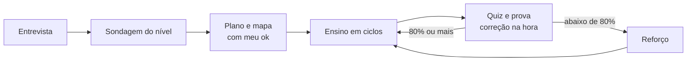

# Tutor Adaptativo

Meu sistema pessoal de estudo para o Claude: **ao vivo** e **adaptativo**, para **qualquer matéria** — programação, idiomas, matemática, ciências, música, concursos, um curso inteiro ou uma dúvida solta.

Em vez de entregar material pronto, o Claude **ensina comigo em conversa**: descobre onde meu conhecimento termina, propõe um plano que eu aprovo, ensina uma ideia por vez e confere na hora se ela pegou.



## O que tem aqui

```
.claude-plugin/marketplace.json          ← catálogo: permite instalar direto do GitHub
plugins/tutor-adaptativo/
├── .claude-plugin/plugin.json           ← manifesto do plugin
├── output-styles/tutor.md               ← estilo de resposta opcional: voz de professor (veja "Dicas")
├── evals/                               ← 9 testes automáticos (veja "Testes automáticos")
├── skills/tutor-adaptativo/             ← a skill
│   ├── SKILL.md                         ← perfil, regras e comandos
│   ├── CHANGELOG.md
│   ├── references/                      ← o passo a passo de cada etapa (12 arquivos, incl. arquivos.md e visuais-modelos.md)
│   └── scripts/                         ← quiz.py, fila.py, boletim.py, render.py, ver.py, selftest.py
├── agents/
│   ├── tutor-pesquisador.md             ← subagente: verifica fatos e acha fontes
│   └── tutor-diagramador.md             ← subagente: cria diagramas e os verifica
LICENSE                                  ← MIT
```

## Instalar

### A) Plugin no Claude Code (skill + subagentes) — recomendado

No Claude Code:

```text
/plugin marketplace add IvoL1/tutor-adaptativo
/plugin install tutor-adaptativo@tutor-adaptativo
```

### B) Só a skill, sem plugin

Copie a pasta `plugins/tutor-adaptativo/skills/tutor-adaptativo` para `~/.claude/skills/`. Para ter também os subagentes, copie `plugins/tutor-adaptativo/agents/*.md` para `~/.claude/agents/`.

### C) App do Claude (skill avulsa)

Gere um ZIP **da pasta da skill** (`tutor-adaptativo`, com `SKILL.md` e `references/`) — a pasta da skill precisa ficar na raiz do ZIP — e suba em **Customize → Skills → + → Create skill → Upload a skill**. É preciso ter *Code execution and file creation* ligado (Settings → Capabilities). Skills enviadas ao app valem só para a sua conta e **não** sincronizam com o Claude Code: cada lugar recebe a sua cópia.

Dica: anexe esse ZIP numa *Release* do GitHub, porque o ZIP automático do GitHub embrulha tudo numa pasta `nome-do-repositório-tag`, e o nome da pasta deixa de ser o da skill.

> Sem subagentes e sem acesso a arquivos (caso do chat do claude.ai), a skill continua funcionando: ela mesma pesquisa e desenha, e no lugar dos registros em disco entrega um **Cartão de retomada** no fim de cada sessão, que você cola na próxima. Ver `references/ferramentas.md` e `references/sessao.md`.

## Como usar

1. **Matéria nova:** diga "quero estudar X". Ela faz a entrevista, a sondagem e o plano.
2. **Dia a dia:** diga `"retomar"`. Ela lê onde você parou, faz a Revisão do dia e segue.
3. **Dúvida solta:** é só perguntar — ela usa a versão curta do método.
4. **Travou?** Diga `"dica"` (um degrau por vez) ou `"travei"` (encolhe o passo).

Todos os comandos estão na tabela de `SKILL.md`.

## O que a diferencia

- **Sondagem:** acha o *piso* e o *teto* do seu conhecimento em cada fio do assunto antes de planejar. A sondagem nunca vale nota.
- **Plano com mapa de dependências:** você vê a trilha como um grafo e aprova antes da primeira aula.
- **Ciclo por ideia:** motivar → estabelecer → conectar → checar. Nenhuma ideia é construída em cima de outra que não pegou.
- **Quizzes corrigidos por código**, com alternativas escritas por um procedimento e **verificadas por script** (para a certa não se entregar pela forma), posição sorteada, "não sei" como resposta legítima, confiança marcada antes do resultado e, depois de um erro, "o que você estava pensando?".
- **Repetição espaçada:** toda sessão começa pela Revisão do dia. Erro confiante volta à fila em 1 dia.
- **Protocolo Antifrustração:** feito para quem desanima quando o assunto fica difícil — dica em escada, passo que encolhe, sessão mínima viável.
- **Nada desatualizado:** ensina só o que a fonte oficial atual recomenda, com versão congelada por trilha.

## Ferramentas: o código decide o que não pode depender de obediência

Sorteio, verificação, contas, datas, médias e renderização ficam em scripts Python (3.8+, só biblioteca padrão, sem rede, exceto o `render.py` e as fórmulas e diagramas do `ver.py`). **Nenhum deles grava na pasta de estudos** (isso é com as ferramentas de arquivo, abaixo):

| Script | O que faz por código |
|---|---|
| `quiz.py` | sorteia a posição da certa (nunca a mesma duas vezes seguidas), **acusa alternativa que se entrega pela forma** (tamanho, "porque", negrito assimétrico, "todas as anteriores"), corrige, revela o equívoco da errada escolhida e calcula o percentual e a decisão da prova (80% e 50%), avisa quando a amostra é pequena |
| `fila.py` | repetição espaçada: intervalos 1d → 3d → 7d → 16d → 35d → 60d → 120d → arquivado, e as datas; acerto frágil não avança. Lê o `conhecimento.md` (com `--sem-gravar`) ou o texto pelo stdin e devolve a seção da fila já atualizada (`SECAO`/`CONTEUDO`), sem gravar |
| `boletim.py` | lê o `progresso.md`, as notas de exercícios e as sessões e devolve o bloco do boletim: tabela das provas com a **média calculada**, exercícios feitos de quantos, pendências abertas |
| `render.py` | valida Mermaid/SVG e gera PNG com o Chrome ou o Edge já instalados, **devolvendo a mensagem exata de erro de sintaxe**; aceita `--mermaid-js` (arquivo local, offline) e entrega a imagem no tamanho exato |
| `ver.py` | **leitor**: converte as notas `.md` em páginas HTML numa pasta temporária (tabelas, dicas dobráveis, fórmulas, diagramas, imagens, links entre notas) e abre no navegador; não grava nada nos estudos |

`python plugins/tutor-adaptativo/skills/tutor-adaptativo/scripts/selftest.py` roda as verificações (sem rede e sem tocar nos seus arquivos). Sem Python, a skill funciona igual: cada seção de `references/ferramentas.md` tem um plano B à mão.

**Permissões:** na primeira vez, o Claude Code pede permissão para rodar `python`. Para não ser perguntado a cada quiz, depois de ler o código (está todo neste repositório) você pode liberar só estes scripts nas suas permissões (`settings.json`): `"Bash(python *tutor-adaptativo/scripts/*)"` e `"Bash(python3 *tutor-adaptativo/scripts/*)"` (no Windows, o comando que costuma funcionar é `py`: acrescente `"Bash(py *tutor-adaptativo/scripts/*)"`). O campo `allowed-tools` da skill só vale no turno em que ela é chamada, por isso não o usei.

## A pasta de estudos (Markdown comum, sem programa nenhum)

Tudo que a skill guarda é **uma pasta de arquivos Markdown**, por exemplo `Documents\Estudos`, com **uma subpasta por matéria**. Não precisa de programa extra, de plugin nem de servidor: o Claude Code aberto nessa pasta lê e grava com as ferramentas de arquivo (`Read`, `Write`, `Edit`, `Glob`, `Grep`), e qualquer editor de texto abre os arquivos.

```
Estudos/
├── README.md, CLAUDE.md
└── matematica-basica/
    ├── _painel-matematica-basica.md      ← o mapa e o próximo passo
    ├── _boletim-matematica-basica.md     ← provas (com a média), exercícios e sessões
    ├── sessoes/  exercicios/  provas/  anexos/  fontes/
    ├── pratica/                          ← suas respostas (só você escreve aqui)
    └── registros-da-skill/               ← trilha, progresso, conhecimento, conquistas
```

**Como estudar:** abra o terminal **dentro da pasta de estudos** e rode `claude`. No Windows, um atalho `estudar.cmd` numa pasta do PATH (`cd /d "%USERPROFILE%\Documents\Estudos" && claude %*`) deixa isso em um comando. O Claude ensina no terminal, e o que é longo ou visual (enunciados, desafios, diagramas, provas) vai para notas, que você lê no navegador com `"abrir"`.

As edições usam `Edit` (troca de trecho exato) e, só em arquivo do Claude, ler e regravar com `Write`, com uma conferência ao fim (e releitura depois de qualquer `Write` sobre arquivo existente). As receitas e as regras de segurança estão em [`references/arquivos.md`](plugins/tutor-adaptativo/skills/tutor-adaptativo/references/arquivos.md).

### O que o Claude faz por você

| O que você quer | Como (o Claude faz sozinho; você só pede) |
|---|---|
| Retomar | `"retomar"`: lê `progresso.md`, `conquistas.md` e `conhecimento.md` da matéria e faz a Revisão do dia (as datas vêm do `fila.py`) |
| Começar uma matéria com tudo no lugar | depois do seu "ok" no plano, grava os 4 registros, painel, boletim e `pratica/`, e põe no `README.md`. Nunca sobrescreve |
| Anotar a sessão | cria `sessoes/AAAA-MM-DD-título.md` com frontmatter, acrescenta se já houver nota do dia e lista no painel |
| Exercícios e desafios | o enunciado vai para `exercicios/` (critério de pronto e **dicas dobráveis, sem a solução**) e abre no navegador; sua resposta fica em `pratica/treinos/`; depois da correção o status vira `feito` e a nota ganha a seção "Correção". `"exportar"` grava o que ficou só na conversa |
| Provas | a prova continua ao vivo (uma questão por vez, corrigida por código); `"prova em nota"` monta o caderno inteiro em `provas/` para você responder de uma vez; o relatório fica em `provas/` |
| Boletim | `"boletim"`: provas com a **média calculada por `boletim.py`**, exercícios feitos de quantos e sessões, em `_boletim-[matéria].md` |
| Ler no navegador | `"abrir"`: `ver.py` converte as notas em páginas (tabelas, dicas, fórmulas, diagramas) numa pasta temporária e abre. Fórmulas e diagramas precisam de rede |
| Diagrama ou gráfico | bloco Mermaid na própria nota; SVG e PNG como arquivos em `anexos/` |
| Estudar a partir de um vídeo | `"transcreve"`: cole a legenda, indique um `.vtt`/`.srt` ou dê o link (com o `yt-dlp` instalado, baixa só a legenda). Grava em `fontes/` com aviso: **transcrição é pista, não fonte para ensinar** |
| Revisar um desenho seu | salve como PNG ou SVG em `pratica/treinos/` e diga o nome: o Claude lê a imagem |

**Regras de segurança** (valem sempre): o Claude lê antes de escrever, só regrava arquivo que é dele (registros, painel, boletim, notas) logo depois de ler (e conferindo o resultado), nunca escreve em `pratica/` (é seu) e nunca apaga. Sem acesso à pasta de estudos, entrega o **Cartão de retomada**. Para reforçar por código, bloqueie `rm` e a escrita em `pratica/` nas permissões (`settings.json`, `deny`).

**O que mudou na 6.0:** a skill ficou autossuficiente: só Markdown comum (links relativos, citações, `<details>`), sem programa nem plugin de terceiros. Ganhou o `boletim.py` (média por código) e o `ver.py` (leitor no navegador). Detalhes no `CHANGELOG.md`.

## Visuais: diagramas, gráficos e imagens

A skill desenha só quando ajuda (Regra 31) e **confere antes de mostrar**. O que ela sabe gerar, em [`references/visuais-modelos.md`](plugins/tutor-adaptativo/skills/tutor-adaptativo/references/visuais-modelos.md):

- **Mermaid** (renderiza no `ver.py` e no GitHub): fluxo e mapa de dependências, sequência, estado, ER, classes, mapa mental, linha do tempo, git, quadrante, pizza, gantt e gráfico de linha/barra (`xychart-beta`);
- **SVG pronto** para adaptar: reta numérica, plano cartesiano, fração, teclado de piano; valores e coordenadas calculados por código;
- **Gráficos de função e de dados** e matemática em LaTeX;
- **Imagem de fonte confiável** (com crédito), regra para ilustração gerada e **visual interativo** quando a ideia só se entende mexendo.

Limite honesto: a skill valida o Mermaid e o SVG com o `render.py` (11.17.2, a mesma versão do `ver.py`), mas só **vê** o resultado quando há navegador; em tipos `-beta` ela confere o PNG e avisa se ficar estranho.

## Dicas para o dia a dia

- **Estilo de resposta "Tutor" (opcional):** `/output-style` e escolha o estilo do plugin, para a voz de professor valer a sessão toda (frases completas, uma coisa por vez). Se o nome não aparecer na lista, use `/plugin` para conferir se o estilo foi carregado.
- **Plugins que brigam com o estudo:** estilos que mandam responder em fragmentos ou com o mínimo de código (por exemplo `caveman` ou `ponytail`) atrapalham a aula. Na pasta de estudos, desligue-os em `.claude/settings.json` (`"enabledPlugins": {"nome@marketplace": false}`). Skills de aprendizado concorrentes (como a `learn` da Anthropic, que vem do app) podem ser escondidas com `"skillOverrides": {"anthropic-skills:learn": "off"}`; eu não consegui testar o efeito dessas duas chaves numa sessão real.
- **Lembrete da Revisão do dia:** as tarefas agendadas do app desktop rodam na sua máquina e persistem entre sessões. Peça ao Claude uma tarefa diária que leia o `conhecimento.md` e avise quando houver conceitos vencidos. (Ideia não testada.)

## Testes automáticos

`plugins/tutor-adaptativo/evals/` tem 9 casos para o `claude plugin eval` (entrevista, dúvida curta, retomar sem registros, dica sem entregar a resposta, frustração, sondagem, quiz por script, criar a matéria sem pasta de estudos (não inventa) e "não sequestrar tarefa de código"). Rodam com e sem o plugin para medir o que ele acrescenta. Comandos e custo em [`evals/README.md`](plugins/tutor-adaptativo/evals/README.md). Eles usam a sua cota, então não rodam sozinhos.

## Sobre ser pessoal

Esta skill foi feita para mim. A seção "1. Quem sou eu" do `SKILL.md` descreve como eu aprendo e onde travo — é o que calibra todo o resto. Se for usar, **troque essa seção pelo seu perfil**; o restante funciona para qualquer pessoa.

## Desenvolvimento

```bash
claude plugin validate ./plugins/tutor-adaptativo   # valida o plugin
claude plugin validate .                            # valida o marketplace
claude --plugin-dir ./plugins/tutor-adaptativo      # testa numa sessão, sem instalar
```

Mudanças de comportamento ficam registradas em [`CHANGELOG.md`](plugins/tutor-adaptativo/skills/tutor-adaptativo/CHANGELOG.md).

## Créditos e licença

O fluxo de sondagem, plano com mapa de dependências, ciclo por ideia e escrita de alternativas se inspira no sistema [`learn`](https://github.com/amosblomqvist/learn) (repositório de Amos Blomqvist) e no vídeo *How I Use AI to Learn Things* (canal Eero Alvar no YouTube). **Nada foi copiado:** o repositório original não tem licença, então os métodos foram reescritos com palavras e exemplos próprios e adaptados ao meu contexto (ao vivo, em português, com repetição espaçada e antifrustração).

**Licença deste repositório:** MIT (arquivo `LICENSE`), escolhida como padrão por ser a mais simples e permissiva. Se preferir outra, ou nenhuma (sem licença, os direitos ficam reservados ao autor e ninguém pode reutilizar o conteúdo — [documentação do GitHub](https://docs.github.com/en/repositories/managing-your-repositorys-settings-and-features/customizing-your-repository/licensing-a-repository)), troque o arquivo antes de publicar.
