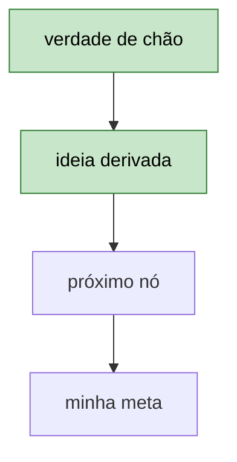
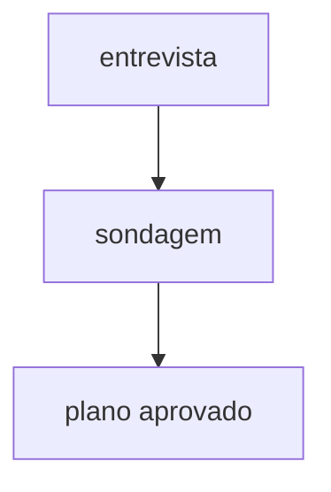
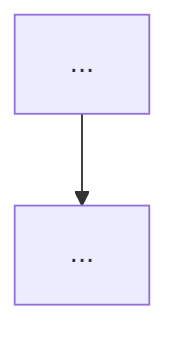

# Referência — Templates dos arquivos

> Use ao gerar `CLAUDE.md`, README do cofre, painel, `trilha.md`, `progresso.md`, `conhecimento.md`, `conquistas.md`, a nota da sessão ou o Cartão de retomada.

> **Nesta referência:**
> **1. Convenções Obsidian (valem para TODO arquivo gerado)**
> **2. Templates**
>     · Template: `CLAUDE.md` (raiz do cofre — ponteiro, gerado 1x)
>     · Template: `README.md` (raiz do cofre — índice geral, gerado com a primeira matéria)
>     · Template: `_painel-[matéria].md` (o mapa e o painel da matéria — atualizado ao fim de cada sessão)
>     · Template: Painel inicial (o começo honesto de uma matéria recém-criada)
>     · Template: `_sessoes-[matéria].base` (tabela nativa das sessões)
>     · Template: `_leia-me.md` de `pratica/`
>     · Template: `trilha.md`
>     · Template: `progresso.md`
>     · Template: `conhecimento.md`
>     · Template: `conquistas.md`
>     · Template: nota da sessão (`sessoes/AAAA-MM-DD-[tópico].md`)
>     · Template: Cartão de retomada

## Convenções Obsidian (valem para TODO arquivo gerado)

> A documentação é feita para ser lida no Obsidian, sem quebrar Markdown padrão:
- **Frontmatter YAML** no topo de todo arquivo gerado **dentro da pasta de uma matéria**: `tipo` (sessao/registro/indice), `materia`, `topico`, `parte`, `tags` — mais `data` nas notas de sessão. Campos que não se aplicam ao arquivo (um painel não tem `parte`) simplesmente não entram. Invisível no Markdown puro, vira propriedades no Obsidian. **Exceção:** `README.md` e `CLAUDE.md` da raiz de `estudos/` não levam frontmatter — não pertencem a nenhuma matéria.
- **[[Wikilinks]]** para conectar arquivos: o painel linka as notas de sessão; as notas linkam conceitos do `conhecimento` da matéria quando citados. Sem extensão; quando o nome se repete entre matérias, com o caminho (ver "Wikilinks entre matérias" abaixo).
- **Callouts** no lugar de HTML: celebração ou conquista usa `> [!success]`; avisos usam `> [!warning]`; perguntas em aberto usam `> [!question]`; destaques usam `> [!info]`. Em Markdown puro degradam como citações, sem quebrar nada.
- **Diagramas em mermaid:** um bloco ```` ```mermaid ```` renderiza nativo no Obsidian e no GitHub (`references/visuais.md`).
- **Matemática em LaTeX:** `$f(x)$` em linha e `$$` em bloco próprio — o Obsidian renderiza nativamente. Sempre que houver notação matemática, escreva em LaTeX, e não em aproximação de texto simples.
- **Nomes de arquivo:** minúsculos, com hifens, autoexplicativos (`2026-09-30-funcoes.md`, nunca `nota1.md`).
- **Imagens e diagramas** ficam em `[matéria]/anexos/` e entram na nota com `![[arquivo.png]]` (largura opcional: `![[arquivo.png|500]]`); como gravar (Mermaid no corpo, SVG como texto, PNG só com acesso ao disco) está em `references/obsidian.md` → "Visuais e imagens".
- **Wikilinks entre matérias:** nomes como `conquistas` e `progresso` existem em toda matéria, então um `[[conquistas]]` solto fica ambíguo. Use o caminho completo a partir do cofre com apelido: `[[ingles/registros-da-skill/conquistas|conquistas]]`. Só os nomes únicos (`_painel-[matéria]`, notas de `sessoes/`) podem ir sem caminho.

## Templates

### Template: `CLAUDE.md` (raiz do cofre — ponteiro, gerado 1x)

```markdown
# Cofre de estudos do Ivo

Este cofre usa a skill **tutor-adaptativo**. Siga-a para tudo
(entrevista, sondagem, plano, aula, quiz, estrutura de pastas). Não duplique regras aqui.

- A posição de cada matéria está em `[matéria]/registros-da-skill/progresso.md`.
  Esses arquivos são a única fonte de verdade sobre onde parei.
- Ignore memórias automáticas de sessões antigas sobre estudos; se conflitarem
  com os registros, os registros vencem.
- Leia e grave neste cofre por arquivos, seguindo `references/obsidian.md` da skill:
  ler antes de escrever, sobrescrever só arquivo do Claude logo depois de ler, nunca mexer em `pratica/`, nunca apagar.

## Como aprendo (vale para qualquer matéria)
- Interesses para analogias e exemplos: [jogos, filmes, séries...]

### Dificuldades persistentes
- (o Claude acrescenta aqui quando um padrão novo aparecer; ponto de partida em `references/pedagogia.md` → "Meu histórico de dificuldades")

### Dificuldades superadas
- (o que foi difícil e como foi resolvido)
```

> Este é o único lugar onde o histórico de dificuldades é **atualizado**: o arquivo da skill é sobrescrito a cada atualização do plugin, o `CLAUDE.md` do cofre não.

### Template: `README.md` (raiz do cofre — índice geral, gerado com a primeira matéria)

```markdown
# Estudos do Ivo

Índice do cofre. Cada matéria tem a sua pasta, e dentro dela o painel é a porta
de entrada. O sistema é a skill **tutor-adaptativo**.

## Matérias ativas
- [[_painel-[matéria]|[Matéria]]] — T[N] parte [X] · ▶ [próximo passo em 1 frase]

## Matérias concluídas
- [[_painel-[matéria]|[Matéria]]] — concluída em [AAAA-MM-DD] · entra em `"manutenção"`

## Como uso isto
1. Abro o Claude e digo `"retomar"` (ou o nome da matéria).
2. Ele me leva do ponto em que parei.
3. No fim, ele grava a nota da sessão e o próximo passo.
```

> Atualizado quando uma matéria nasce, muda de posição ou conclui.

### Template: `_painel-[matéria].md` (o mapa e o painel da matéria — atualizado ao fim de cada sessão)

````markdown
---
tipo: indice
materia: [matéria]
tags: [materia]
---
# 📚 [Matéria]

> [!info] ▶ Próximo passo
> [nó ou tópico] — [o que fazer nele em 1 frase]

## Mapa de dependências
> O mapa aprovado na Fase 2 do plano. Nós firmes em verde; o que vem depois, em cinza.



## Trilha
- [x] T1 — [Tópico] → 1a ✅ (5/5) · 1b 🔄 em andamento · 1c ⬜
- [ ] T2 — [Tópico] ⬜

## Sessões recentes
- [[2026-09-30-tópico]] — [a ideia que encaixou]

## Onde mexo e onde não mexo
- ✍️ **Mexo:** `pratica/`
- 🚫 **Não mexo:** `registros-da-skill/` (ler pode — editar não) · `sessoes/` · painel

> [!success] Nos dias difíceis
> Abro [[[matéria]/registros-da-skill/conquistas|conquistas]] e vejo o quanto já andei.
````

### Template: Painel inicial (o começo honesto de uma matéria recém-criada)

> É o `_painel-[matéria].md` do momento da criação, antes de haver trilha: sem trilha de exemplo, sem sessão de mentira e com um mapa mínimo. Depois do plano aprovado, o painel passa ao template acima, por trocas cirúrgicas.

````markdown
---
tipo: indice
materia: [matéria]
tags: [materia]
---
# 📚 [Matéria]

> [!info] ▶ Próximo passo
> Fazer a entrevista e a sondagem; o plano aprovado vira a trilha aqui

## Mapa de dependências
> O mapa aprovado na Fase 2 do plano aparece aqui.



## Trilha
- [ ] (a trilha aparece aqui depois do plano aprovado)

## Sessões recentes
> Tabela com todas: [[_sessoes-[matéria].base|todas as sessões]]
- (nenhuma sessão ainda)

## Onde mexo e onde não mexo
- ✍️ **Mexo:** `pratica/`
- 🚫 **Não mexo:** `registros-da-skill/` (ler pode — editar não) · `sessoes/` · painel

> [!success] Nos dias difíceis
> Abro [[[matéria]/registros-da-skill/conquistas|conquistas]] e vejo o quanto já andei.
````

### Template: `_sessoes-[matéria].base` (tabela nativa das sessões)

> Recurso **Bases** do Obsidian (plugin do núcleo). Lista as notas de `sessoes/` pelo frontmatter. Troque `[caminho da matéria]` pelo caminho da pasta da matéria a partir da raiz do cofre. Se a ferramenta recusar a extensão `.base`, a matéria funciona sem ela.

```yaml
filters:
  and:
    - file.inFolder("[caminho da matéria]/sessoes")

formulas: {}

properties:
  file.name:
    displayName: "Sessão"
  note.data:
    displayName: "Data"
  note.topico:
    displayName: "Tópico"

views:
  - type: table
    name: "Sessões"
    order:
      - file.name
      - note.data
      - note.topico
    summaries: {}
```

> Exemplo: com a raiz de estudos em `estudos/` e a matéria `ingles`, fica `file.inFolder("estudos/ingles/sessoes")`. Com a raiz de estudos sendo o próprio cofre, `file.inFolder("ingles/sessoes")`.

### Template: `_leia-me.md` de `pratica/`

> Um para `pratica/projeto/` e outro para `pratica/treinos/`. Já diz de quem a pasta é e a deixa visível no Obsidian.

```markdown
---
tipo: indice
materia: [matéria]
tags: [materia]
---
# ✍️ [projeto de prática | treinos] — [Matéria]

> [!info] Esta pasta é minha
> Aqui eu escrevo e guardo o que faço. O Claude lê, revisa e sugere, mas não edita nem apaga nada aqui.

- **`projeto/`:** o projeto de prática, que cresce a trilha inteira.
- **`treinos/`:** exercícios soltos, uma subpasta por parte (`t1-1a/`, `t1-1b/`…).
```

### Template: `trilha.md`
> Gerado depois da entrevista, da sondagem e do meu "ok" no plano. Não preencha à mão — o Claude gera a partir das respostas.

```markdown
# trilha.md — [Nome da Matéria]

**Status:** rascunho / aprovado em [AAAA-MM-DD] _(rascunho = entrevista, sondagem ou plano ainda sem o meu "ok")_

## Contexto
- Matéria / Nível atual (da Sondagem) / Objetivo final / Por que agora:
- Ritmo: [sessões/semana] × [duração]
- **Orçamento de tempo por sessão:** [30min/1h/2h] — usado para dimensionar cada sessão (Regra 24)
- Prazo (se houver):
- **Ambiente e recursos:** [computador/SO/editor, instrumento, materiais…] — evita instruções que não batem com o meu ambiente
- **Raiz dos estudos no cofre:** [caminho da pasta de estudos a partir da raiz do cofre Obsidian, ex.: `estudos/`; e, se o Claude alcança o disco, a pasta do cofre; ou "sem acesso a arquivos"]
- **Bagagem relacionada:** [o que já domino de parecido + tempo, ou "nenhuma"] — usar para analogias em vez de ensinar do zero o que é transferível
- **Interesses pessoais (para analogias e exemplos):** [hobbies, áreas de interesse — ou "nenhum informado"]
- Fonte de referência: [URL, livro, norma…]
- **Versão ou edição adotada (congelada):** [ex.: 16.3.x — estável em DD/MM/AAAA] — ver `references/pedagogia.md` → "Fontes e versão — regra permanente"

## Sondagem (resultado)
| Fio | Piso (o que acerto) | Teto (onde termina) | Concepção errada? |
|---|---|---|---|
| — | — | — | — |

## Convenções desta matéria (levantadas da fonte oficial)
> O que torna o sistema agnóstico: o específico da matéria mora aqui.
- Nomenclatura / notação: [tabela: tipo de item → convenção → exemplo]
- Estrutura recomendada: [árvore, quando fizer sentido]
- Boas práticas próprias da matéria: [lista]
- Ferramentas: [versionamento, testes, verificação, prática…]

### Se for matéria composta (ex.: Next.js sobre React) — ver `references/pedagogia.md`
> Legado é registro interno, nunca ensinado por iniciativa própria — só reconhecido se eu perguntar direto.

| Padrão atual (ensinar como central) | Padrão legado (só reconhecer se eu perguntar) |
|---|---|
| — | — |

## Estilo de aprendizado
- Prefere (nesta matéria): construir primeiro / entender primeiro — _não presuma; pode variar por matéria_
- Formato de prova preferido:
- "Saber bem" significa:
- Exercícios soltos extras (fora do projeto)? [sim/não]

## Mapa de dependências (aprovado)
[o mesmo diagrama mermaid do `_painel-[matéria].md`, como registro da versão aprovada]

## Projeto de prática (a espinha)
- Ideia original: [o que eu trouxe, ou o que o Claude propôs]
- Ajustes sugeridos no destrinche: [1-3 ajustes propostos antes da análise de cobertura]
- Escolhido (versão final): [título e descrição — refinada ou original, minha decisão]
- Esqueleto que anda (1ª meta — menor versão que funciona): [descrição]
- Cada parte o faz avançar (algo novo ou endurecimento)
- Cobertura: [N]/[total] ([%]) — Forte/Adequada/Fraca
- Conceitos centrais descobertos / lacunas: [se houver]

## Trilha de estudos
> Marque (c) = central, (p) = periférico em cada conceito.
- [ ] Tópico 1 — [nome] ([N] partes)  [dominado? se a sondagem não achou teto]
    - [ ] Parte 1a — [nome]
- [ ] Tópico 2 — [nome]

## Dificuldades específicas desta matéria
- Histórico emocional (da entrevista, Q4): [já tentou antes e desistiu? ansiedade específica? — ou "nenhum relatado"]
_(demais dificuldades: preencha conforme aparecerem ao longo da trilha)_

## Referências
- Fonte de referência / outros recursos validados:
```

### Template: `progresso.md`

```markdown
# progresso.md — [Nome da Matéria]

## Posição atual
- Tópico / Parte / Nó / Próximo passo:

## Pendências abertas
> Tudo que ficou `[travei]` (ou pedi `"resposta"`) e ainda não foi resolvido. O Claude acrescenta durante a sessão e risca quando o conceito é reensinado e acertado. É esta lista que o checkpoint a cada 3 tópicos puxa (`references/pedagogia.md` → "Checkpoints — a cada 3 tópicos", passo 5).

| Conceito | Onde travou | Marcado em | Status |
|---|---|---|---|
| — | — | — | aberto / resolvido em [data] |

## Histórico de provas
## Prova — Tópico [X], Parte [Y] — [data]
- Resultado: [%] | Status: ✅/⚠️/🔁
- Conceitos com erro: [...]
- Erros confiantes (🟢 + ❌): [...]
- Lacunas (não sei): [...]
- Nota de esforço (1-5): [...]
- Reprova (se houver): [%] — [data]

## Checkpoints
## Checkpoint — após T[N] — [data]
- Melhorias / refatorações / padrão aprendido:

## Linha do tempo (sessões)
- [data] — o que fiz, como me senti (para acompanhar a continuidade)
```

### Template: `conhecimento.md`
> Tudo o que é "conhecimento acumulado" mora num arquivo só, para não ter que abrir dois arquivos parecidos toda sessão.

```markdown
# conhecimento.md — [Nome da Matéria]

## Conceitos por tópico
*(preenchido durante os estudos)*

## Padrões e decisões
*(preenchido em checkpoints e revisões)*

## Erros comuns que já cometi
*(preenchido quando um erro se repetir — serve de alerta)*

## Glossário
> Escreva com as suas palavras — não copie definições prontas.
| Termo | O que significa (com minhas palavras) |
|-------|----------------------------------------|
| — | — |

## Fila de revisão espaçada
> Conceitos aprovados entram aqui. Intervalos: 1d → 3d → 7d → 16d → 35d → 60d → 120d → arquivado.
> Acertou na revisão: avança. Errou: volta para 1d e vira reforço.
> Erro confiante (🟢 + ❌) entra a 1d depois do reforço.
> `Status` = `ativo` ou `arquivado` (passou dos 120d) — é daqui que sai a métrica "Conceitos arquivados" do `conquistas.md`.

| Conceito | Tópico/Parte | Aprendido em | Intervalo atual | Próxima revisão | Status |
|----------|--------------|--------------|-----------------|-----------------|--------|
| — | — | — | — | — | ativo |
```

### Template: `conquistas.md`
> Ver o template completo (dashboard + changelog) em `references/projetos.md`, seção "Changelog de conquistas (`conquistas.md`)". O Dashboard guarda a **data da última sessão** — é o que decide se a próxima sessão abre com a Reentrada.

### Template: nota da sessão (`sessoes/AAAA-MM-DD-[tópico].md`)
> É o diário da sessão, escrito pelo Claude ao fim dela (ou quando eu disser `"salva"`). Serve para eu reler, no Obsidian e com tudo renderizado (diagramas, matemática, código), o que entendi — sem precisar rolar a conversa. Guarde o que vale reler, não a transcrição inteira.

````markdown
---
tipo: sessao
materia: [matéria]
data: AAAA-MM-DD
topico: t[N]
tags: [materia, sessao]
---
# Sessão AAAA-MM-DD — [o que foi estudado]

> [!success] A ideia que encaixou hoje
> [uma frase]

## O que vimos
- [nó ou conceito] — [1 linha] · checagem: ✅ / ❌ / não sei
- [nó ou conceito] — [1 linha] · checagem: ✅ / ❌ / não sei

## Mapa (se mudou)


## Onde travei e dúvidas em aberto
- [conceito] — [o que não bateu]

## Para a próxima
▶ [próximo passo] · Revisão do dia pendente: [N] conceitos
````

### Template: Cartão de retomada
> Para ambientes **sem acesso a arquivos**. Entregue no fim de toda sessão e quando eu disser `"salva"`; eu colo no começo da próxima conversa com `"retomar"`. Curto — cabe numa tela (`references/sessao.md` → "Sem acesso a arquivos — Cartão de retomada").

```markdown
## Cartão de retomada — [matéria] — AAAA-MM-DD
- Matéria / fonte e versão congelada:
- Sobre mim (tempo por sessão · interesses · histórico emocional):
- Posição: tópico / parte / nó
- Próximo passo:
- Pendências abertas:
- Fila de revisão (conceito · intervalo · próxima revisão):
- Glossário novo:
- Último resultado de prova ou quiz:
```
