# Referência — Modelos de visuais (catálogo, SVG pronto, gráficos, canvas)

> Leia depois de `references/visuais.md` decidir que **vale** desenhar, e antes de escolher o tipo de visual ou de escrever o código dele. Os modelos abaixo foram conferidos: os blocos Mermaid passaram no analisador do Mermaid **11.4.1** (a versão que o Obsidian embute, segundo o fórum dele) e do 11.17.2 (o do `render.py`), e os SVG são XML válido que renderiza.

> **Nesta referência:**
> **1. Qual visual para qual ideia**
> **2. Mermaid: modelos mínimos**
> **3. SVG: modelos prontos para adaptar**
> **4. Gráficos de função e de dados**
> **5. Matemática, química e código na nota**
> **6. Mapa navegável no Obsidian (Canvas, opcional)**
> **7. Imagem de fonte confiável, ilustração e visual interativo**
> **8. Compatibilidade com o Obsidian**

## Qual visual para qual ideia

| A ideia é… | Use | Tipo |
|---|---|---|
| dependência entre conceitos, passo a passo, decisão | Mermaid | `graph TD` / `graph LR` |
| troca de mensagens ou chamadas entre partes, ao longo do tempo | Mermaid | `sequenceDiagram` |
| algo que muda de estado (rascunho → aprovado; conectado → desconectado) | Mermaid | `stateDiagram-v2` |
| entidades e como se relacionam (banco de dados, modelo de dados) | Mermaid | `erDiagram` |
| tipos, heranças e partes de um objeto (programação) | Mermaid | `classDiagram` |
| um assunto com ramos (visão geral de um campo, famílias de verbos) | Mermaid | `mindmap` |
| eventos em ordem cronológica (história, versões, biografia) | Mermaid | `timeline` |
| ramos e merges do git | Mermaid | `gitGraph` |
| prioridades em duas dimensões (importância × domínio) | Mermaid | `quadrantChart` |
| partes de um todo (poucas fatias) | Mermaid | `pie` |
| uma função $y=f(x)$, uma série (provas ao longo do tempo) | Mermaid | `xychart-beta` (ou SVG) |
| plano de estudo no calendário | Mermaid | `gantt` |
| reta numérica, plano cartesiano, vetor, ponto, segmento | SVG | modelos abaixo |
| fração, área, proporção como barra | SVG | modelo abaixo |
| teclado, braço de instrumento, qualquer **layout físico** | SVG | modelo abaixo |
| geometria sob medida (triângulo, ângulo, círculo) | SVG | desenhe com coordenadas calculadas |
| tabela comparativa | Markdown | tabela, não desenho |
| o conceito só se entende **mexendo** (arrastar, mudar um número e ver o efeito) | visual interativo | seção 7 |

Os tipos marcados `-beta` e os que o Obsidian pode não conhecer estão na seção 8.

## Mermaid: modelos mínimos

Rótulos curtos, poucos nós (Regra 31). Tudo isto vale como ponto de partida; **releia cada seta** contra a aula.

````markdown
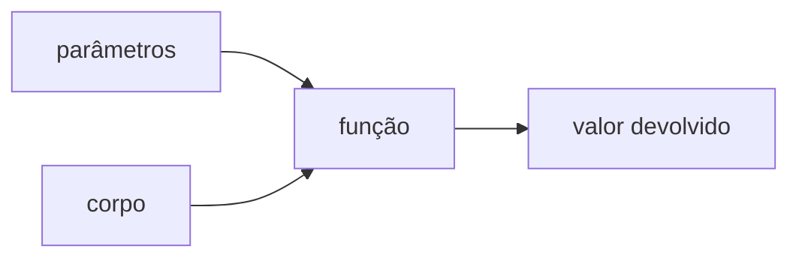
````

````markdown
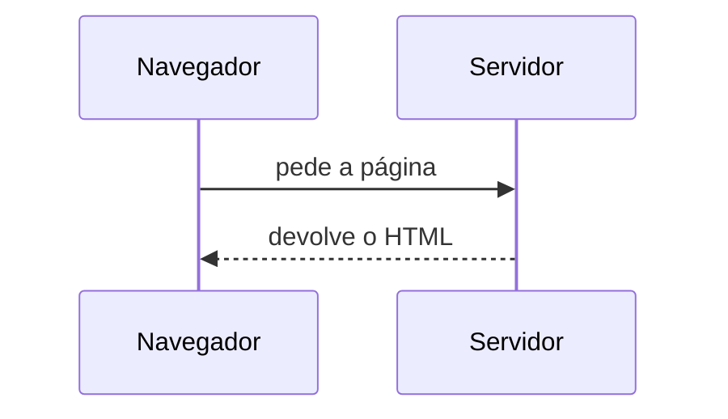
````

````markdown
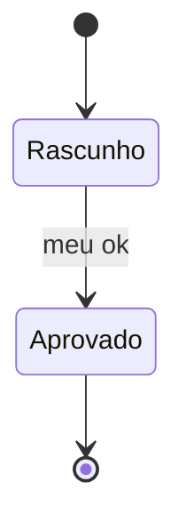
````

````markdown
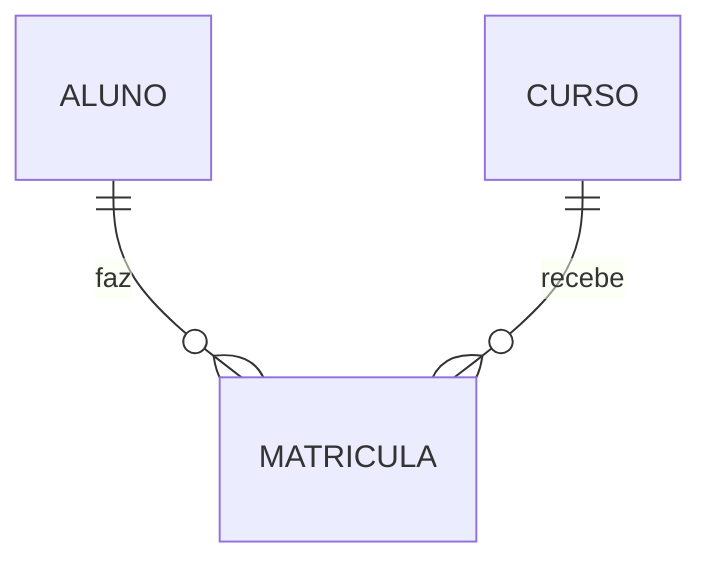
````

````markdown
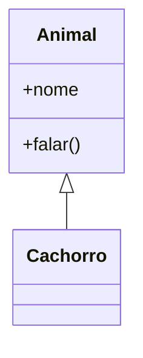
````

````markdown
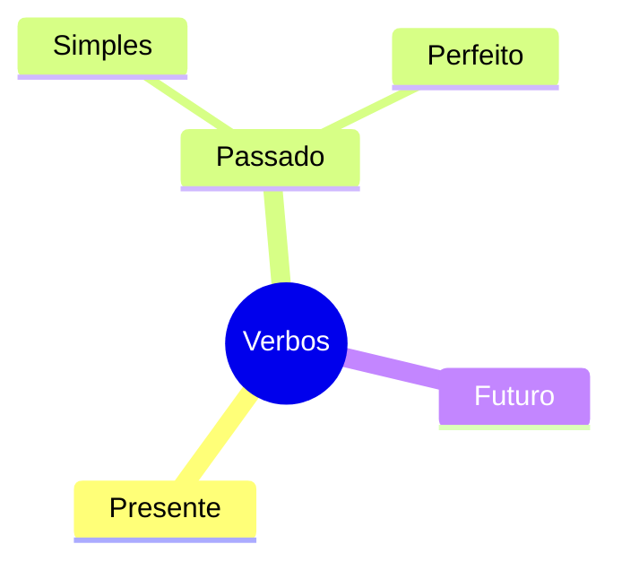
````

````markdown
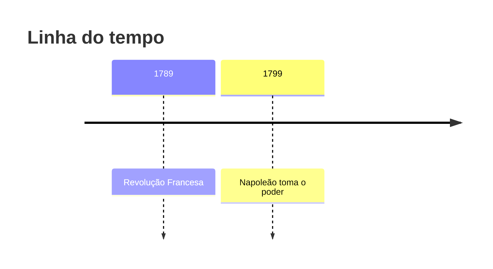
````

````markdown
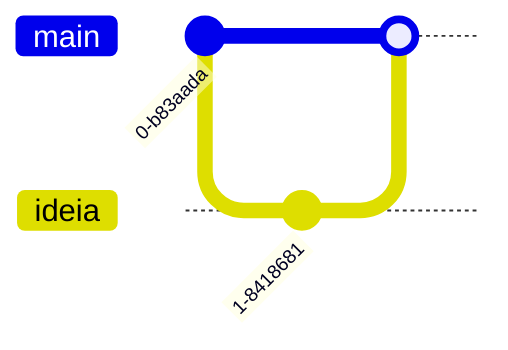
````

````markdown
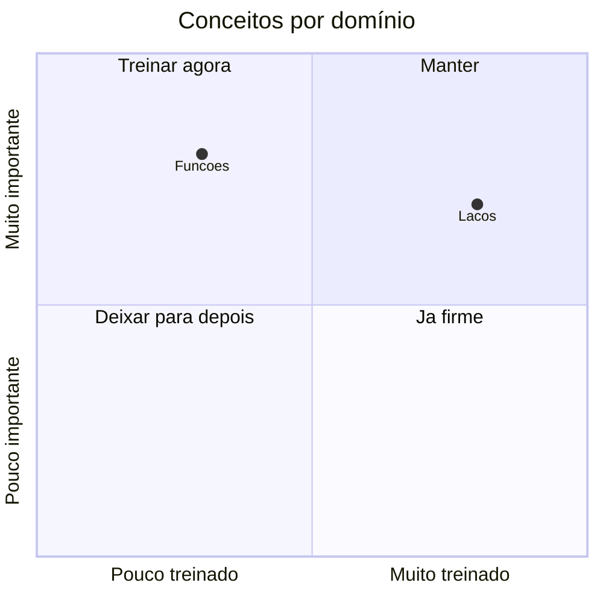
````

````markdown
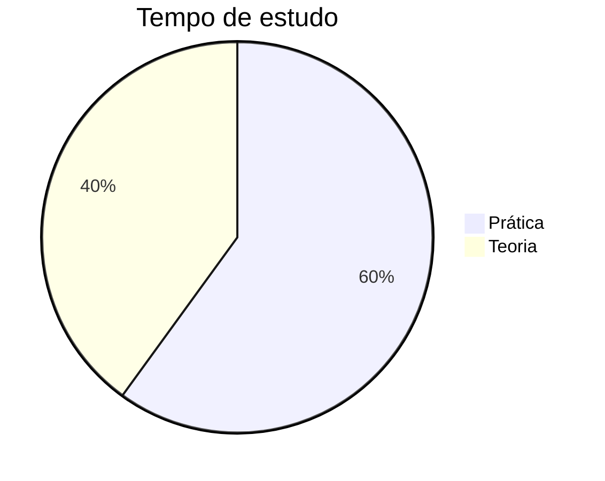
````

````markdown
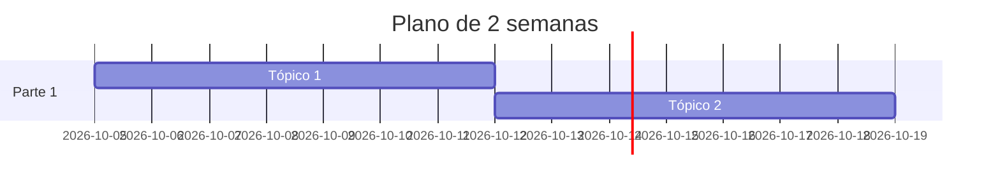
````

**`quadrantChart`: só ASCII nos rótulos dos quadrantes e dos pontos.** O analisador do Mermaid 11.4.1 (o do Obsidian) recusa acento e cedilha ali (`já`, `Funções` dão erro de sintaxe); título e eixos aceitam acento. Nos demais tipos testados, acento funciona.

**Estado de domínio no mapa de dependências** (o do painel): nós firmes em verde, o resto cinza, com `classDef` (modelo em `references/templates.md` → painel).

## SVG: modelos prontos para adaptar

SVG é texto: dá para gravar como `anexos/AAAA-MM-DD-nome.svg` pelo MCP e embutir com `![[…svg]]`, ou colar num bloco ```` ```svg ```` quando o ambiente renderizar. Regras do desenhista: fundo branco, traço escuro, **uma** cor de destaque (`#d9480f`), fonte a partir de 12, nada fora do `viewBox`. **Coordenadas se calculam, não se estimam:** guarde a conta num comentário (`<!-- 50 px por unidade, zero em x=200 -->`) e, para muitos pontos, calcule no Bash (`awk`).

**Reta numérica** (50 px por unidade; zero em x = 200; ponto em 2 → x = 300):

```svg
<svg xmlns="http://www.w3.org/2000/svg" viewBox="0 0 400 100" width="400" height="100" font-family="sans-serif" font-size="14">
  <rect width="400" height="100" fill="#fff"/>
  <line x1="20" y1="50" x2="380" y2="50" stroke="#222" stroke-width="2"/>
  <polygon points="380,50 370,45 370,55" fill="#222"/>
  <polygon points="20,50 30,45 30,55" fill="#222"/>
  <g stroke="#222" stroke-width="2">
    <line x1="50" y1="44" x2="50" y2="56"/><line x1="100" y1="44" x2="100" y2="56"/>
    <line x1="150" y1="44" x2="150" y2="56"/><line x1="200" y1="44" x2="200" y2="56"/>
    <line x1="250" y1="44" x2="250" y2="56"/><line x1="300" y1="44" x2="300" y2="56"/>
    <line x1="350" y1="44" x2="350" y2="56"/>
  </g>
  <g fill="#222" text-anchor="middle">
    <text x="50" y="76">-3</text><text x="100" y="76">-2</text><text x="150" y="76">-1</text>
    <text x="200" y="76">0</text><text x="250" y="76">1</text><text x="300" y="76">2</text><text x="350" y="76">3</text>
  </g>
  <circle cx="300" cy="50" r="6" fill="#d9480f"/>
  <text x="300" y="32" text-anchor="middle" fill="#d9480f" font-weight="bold">a</text>
</svg>
```

**Plano cartesiano com dois pontos e o segmento** (40 px por unidade; origem em (160, 160); o eixo y do SVG cresce para baixo, então $y_{svg} = 160 - 40\,y$ e $x_{svg} = 160 + 40\,x$; A(1, 2) → (200, 80); B(−2, −1) → (80, 200)):

```svg
<svg xmlns="http://www.w3.org/2000/svg" viewBox="0 0 320 320" width="320" height="320" font-family="sans-serif" font-size="14">
  <rect width="320" height="320" fill="#fff"/>
  <g stroke="#ddd" stroke-width="1">
    <line x1="40" y1="20" x2="40" y2="300"/><line x1="80" y1="20" x2="80" y2="300"/><line x1="120" y1="20" x2="120" y2="300"/>
    <line x1="200" y1="20" x2="200" y2="300"/><line x1="240" y1="20" x2="240" y2="300"/><line x1="280" y1="20" x2="280" y2="300"/>
    <line x1="20" y1="40" x2="300" y2="40"/><line x1="20" y1="80" x2="300" y2="80"/><line x1="20" y1="120" x2="300" y2="120"/>
    <line x1="20" y1="200" x2="300" y2="200"/><line x1="20" y1="240" x2="300" y2="240"/><line x1="20" y1="280" x2="300" y2="280"/>
  </g>
  <g stroke="#222" stroke-width="2">
    <line x1="20" y1="160" x2="300" y2="160"/><line x1="160" y1="300" x2="160" y2="20"/>
  </g>
  <polygon points="300,160 290,155 290,165" fill="#222"/>
  <polygon points="160,20 155,30 165,30" fill="#222"/>
  <text x="304" y="150" fill="#222">x</text><text x="168" y="24" fill="#222">y</text>
  <g fill="#222" font-size="12" text-anchor="middle">
    <text x="200" y="176">1</text><text x="240" y="176">2</text><text x="280" y="176">3</text>
    <text x="120" y="176">-1</text><text x="80" y="176">-2</text><text x="40" y="176">-3</text>
    <text x="148" y="124" text-anchor="end">1</text><text x="148" y="84" text-anchor="end">2</text><text x="148" y="44" text-anchor="end">3</text>
  </g>
  <line x1="200" y1="80" x2="80" y2="200" stroke="#d9480f" stroke-width="2"/>
  <circle cx="200" cy="80" r="5" fill="#d9480f"/><circle cx="80" cy="200" r="5" fill="#d9480f"/>
  <text x="208" y="74" fill="#d9480f" font-weight="bold">A (1, 2)</text>
  <text x="88" y="218" fill="#d9480f" font-weight="bold">B (-2, -1)</text>
</svg>
```

**Fração como barra** (4 partes iguais de 75 px; 3 pintadas = 3/4):

```svg
<svg xmlns="http://www.w3.org/2000/svg" viewBox="0 0 340 90" width="340" height="90" font-family="sans-serif" font-size="16">
  <rect width="340" height="90" fill="#fff"/>
  <rect x="20" y="20" width="75" height="40" fill="#d9480f" fill-opacity="0.35" stroke="#222" stroke-width="2"/>
  <rect x="95" y="20" width="75" height="40" fill="#d9480f" fill-opacity="0.35" stroke="#222" stroke-width="2"/>
  <rect x="170" y="20" width="75" height="40" fill="#d9480f" fill-opacity="0.35" stroke="#222" stroke-width="2"/>
  <rect x="245" y="20" width="75" height="40" fill="#fff" stroke="#222" stroke-width="2"/>
  <text x="170" y="82" text-anchor="middle" fill="#222">3/4 do inteiro</text>
</svg>
```

**Teclado de piano, uma oitava** (7 teclas brancas de 40 px; a tecla de cima fica no meio da divisa entre duas brancas; o destaque vem **antes** das teclas pretas para não cobri-las; aqui o Dó está em destaque):

```svg
<svg xmlns="http://www.w3.org/2000/svg" viewBox="0 0 300 150" width="300" height="150" font-family="sans-serif" font-size="14">
  <rect width="300" height="150" fill="#fff"/>
  <g fill="#fff" stroke="#222" stroke-width="2">
    <rect x="10" y="10" width="40" height="110"/><rect x="50" y="10" width="40" height="110"/><rect x="90" y="10" width="40" height="110"/>
    <rect x="130" y="10" width="40" height="110"/><rect x="170" y="10" width="40" height="110"/><rect x="210" y="10" width="40" height="110"/>
    <rect x="250" y="10" width="40" height="110"/>
  </g>
  <rect x="10" y="10" width="40" height="110" fill="#d9480f" fill-opacity="0.35"/>
  <g fill="#222">
    <rect x="38" y="10" width="24" height="68"/><rect x="78" y="10" width="24" height="68"/>
    <rect x="158" y="10" width="24" height="68"/><rect x="198" y="10" width="24" height="68"/><rect x="238" y="10" width="24" height="68"/>
  </g>
  <g fill="#222" text-anchor="middle">
    <text x="30" y="140">C</text><text x="70" y="140">D</text><text x="110" y="140">E</text><text x="150" y="140">F</text>
    <text x="190" y="140">G</text><text x="230" y="140">A</text><text x="270" y="140">B</text>
  </g>
</svg>
```

Outros layouts físicos (braço de violão, tabuleiro, relógio, calendário) seguem o mesmo método: escolher a unidade (px por casa), calcular as posições e **conferir contra o fato** (quantas casas, qual nota). Um braço de violão com a nota errada é pior que nenhum desenho.

## Gráficos de função e de dados

Para $y=f(x)$ ou uma série de números, o jeito mais seguro é o `xychart-beta` do Mermaid (nativo na nota), com os valores **calculados por código**, não de cabeça:

```bash
awk 'BEGIN { for (x = -3; x <= 3; x++) printf "%s%d", (x > -3 ? ", " : ""), x * x; print "" }'
# 9, 4, 1, 0, 1, 4, 9
```

````markdown
```mermaid
xychart-beta
  title "y = x²"
  x-axis [-3, -2, -1, 0, 1, 2, 3]
  y-axis "y" 0 --> 10
  line [9, 4, 1, 0, 1, 4, 9]
```
````

Resultado das provas ao longo do tempo (`bar` no lugar de `line`; o `quiz.py placar` já dá cada percentual):

````markdown
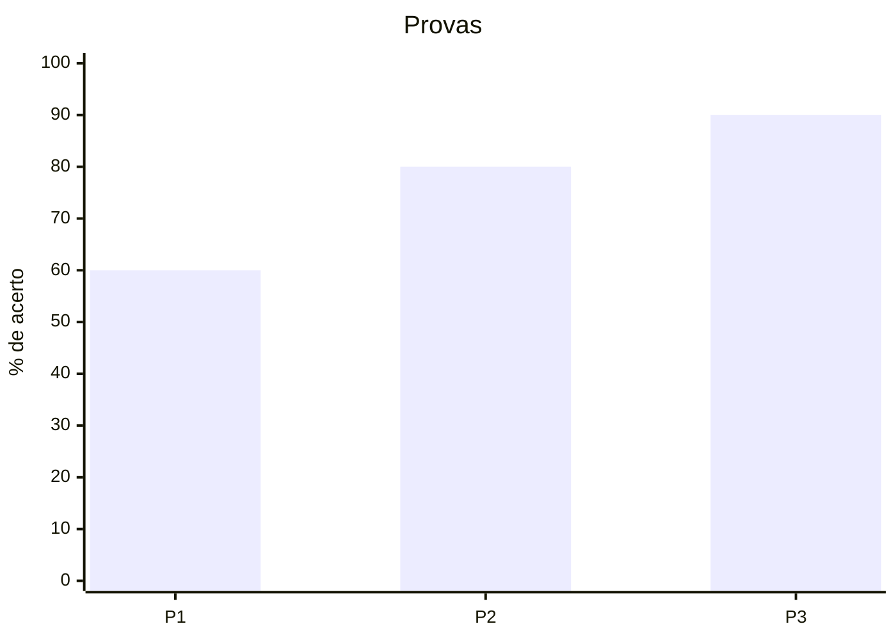
````

Precisa de curva suave, vários eixos ou dados demais? Faça o SVG com `<polyline points="…"/>` e as coordenadas calculadas no `awk`, como no plano cartesiano acima. Gráfico de dados reais: o rótulo diz de onde vêm os números (Regra 8).

## Matemática, química e código na nota

- **Matemática:** LaTeX, `$f(x)=x^2$` em linha e `$$…$$` em bloco próprio. O Obsidian renderiza nativo.
- **Química:** o Obsidian (MathJax) entende `\ce{}`: `$\ce{2H2 + O2 -> 2H2O}$`.
- **Código:** bloco com a linguagem (```` ```python ````); para mostrar o que acontece passo a passo, uma tabela de "estado das variáveis por linha" costuma ensinar mais que um desenho.
- **Tabelas** para comparar (tempos verbais, regras, prós e contras): Markdown puro, sem desenho.
- **Partitura e notação especial:** não há suporte nativo no Obsidian. Use o teclado/braço em SVG (acima), cifra e tablatura em bloco de código monoespaçado, e diga ao Ivo se existir um plugin da comunidade para o caso (a instalação é com ele).

## Mapa navegável no Obsidian (Canvas, opcional)

O mapa de dependências do painel é o Mermaid. Se o Ivo quiser um mapa que **ele arrasta e reorganiza** no Obsidian, grave um arquivo `.canvas` (JSON Canvas, é texto) ao lado do painel, `{RAIZ}/{sg}/mapa-{sg}.canvas`. Se a ferramenta recusar a extensão, o Mermaid do painel continua valendo. Modelo mínimo (dois nós e uma seta):

```json
{
  "nodes": [
    {"id": "n1", "type": "text", "text": "verdade de chão", "x": 0, "y": 0, "width": 220, "height": 60, "color": "4"},
    {"id": "n2", "type": "text", "text": "ideia derivada", "x": 0, "y": 160, "width": 220, "height": 60}
  ],
  "edges": [
    {"id": "e1", "fromNode": "n1", "fromSide": "bottom", "toNode": "n2", "toSide": "top", "label": "sustenta"}
  ]
}
```

Os `id` são únicos; `color` é `"1"` a `"6"` (4 = verde, 1 = vermelho); a seta vai do `fromNode` ao `toNode`. Confira o JSON antes de gravar (uma vírgula sobrando corrompe o canvas). Atualizar o mapa depois é regravar o canvas **inteiro**, então só o ofereça se o Ivo for mesmo usá-lo; o Mermaid é a fonte do mapa aprovado.

## Imagem de fonte confiável, ilustração e visual interativo

- **Foto, mapa, anatomia, obra de arte, espécime** (o que um diagrama não substitui): ache numa fonte confiável (Wikimedia Commons, acervo de museu, site oficial) com a busca na web, **abra a página** para confirmar a imagem e a licença, e embuta por link na nota: ``, com uma linha de crédito (`Fonte: …, licença …`). O Obsidian mostra imagem remota; se a página sumir, a imagem some, então a fonte fica anotada. Não baixe imagem sem licença clara.
- **Imagem gerada por IA:** este sistema não tem gerador de imagem. Se o ambiente tiver um, use só para **ilustração mnemônica** (uma cena para lembrar um vocabulário, por exemplo), marcada como "ilustração gerada", **nunca** para fato (anatomia, mapa, texto dentro da imagem, fórmula, bandeira, partitura): imagem gerada erra isso com cara de certeza (Regra 31).
- **Visual interativo** (Regra 14, prática > teoria): quando a ideia só se entende mexendo — um parâmetro que se arrasta e muda o gráfico, um algoritmo que se executa passo a passo, uma função cujos valores mudam —, uma página HTML de **um arquivo só**, sem dependência externa, pode ensinar mais que qualquer desenho. Se o ambiente tiver a ferramenta de artefatos/HTML, use-a; se não, dê o experimento como exercício (um trecho de código para rodar). Valem as mesmas regras: uma ideia, poucos controles, conferir que o resultado é verdadeiro, e nunca decorativo. O link do artefato entra na nota da sessão.

## Compatibilidade com o Obsidian

- O Obsidian embute o **Mermaid 11.4.1** (informação do fórum do Obsidian; pode mudar quando o Obsidian atualizar), enquanto o `render.py` valida com o 11.17.2. **Testei todos os modelos da seção 2 nas duas versões**: todos passam no analisador de ambas, inclusive os tipos `-beta` (`xychart-beta`, `block-beta`, `architecture-beta`, `packet-beta`) e `kanban`. A única diferença achada é a do `quadrantChart` (ASCII). Mas **analisar não é desenhar**: o layout dos tipos novos pode sair diferente, e eu **não consigo ver a nota renderizada no Obsidian**. Em tipo `-beta`, diga ao Ivo para conferir na nota e tenha a alternativa pronta (SVG ou tabela).
- Para validar contra a versão do Obsidian, use `python "<pasta>/render.py" mermaid entrada.mmd saida.png --mermaid-js mermaid-11.4.1.min.js` (o arquivo sai de `npm pack mermaid@11.4.1`, em `package/dist/mermaid.min.js`). Sem isso, o `render.py` usa o 11.17.2.
- O Obsidian aplica o tema claro/escuro por conta própria. Evite cores fixas de texto em Mermaid; use `classDef` só com preenchimento claro (como no painel) e `color:#000` junto.
- Nome do arquivo de anexo: sem acento, minúsculo, com hifens; embed `![[arquivo.svg|500]]` limita a largura.
